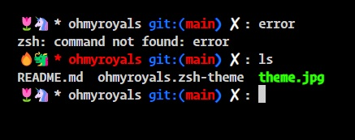

## ohmyroyals zsh theme

Single-line prompt without extra information 

## Installation

For oh-my-zsh users, place into ~/.oh-my-zsh/custom/themes the file ohmyroyals.zsh-theme and change to ZSH_THEME="ohmyroyals" in your ~/.zshrc file

## Contact

Mades Eladrian <mades.eladrian@gmail.com>